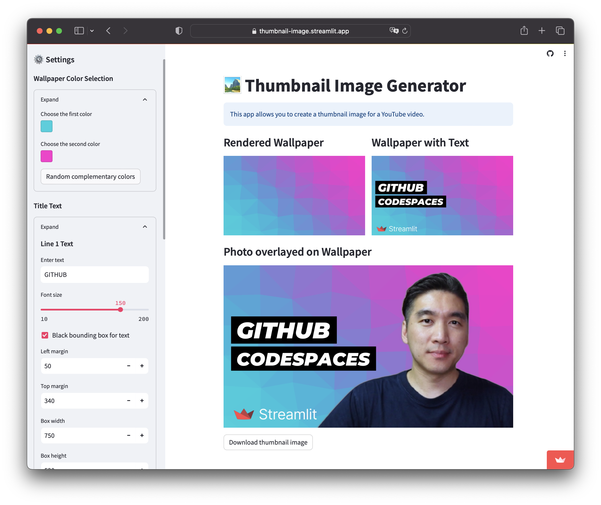

# 🏞️ Thumbnail Image Generator

This app allows you to create thumbnail images for YouTube videos.

## App screenshot

   

## Demo App

## Resources and Libraries used
- Wallpaper generation was performed using the [wallpaper-generator](https://github.com/timozattol/wallpaper-generator) GitHub repo from [timozattol](https://github.com/timozattol/).
- Python libraries used: `PIL`, `subprocess`, `math`, `os`, `random`, `rembg`, `sys` and `streamlit`.
